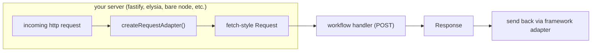
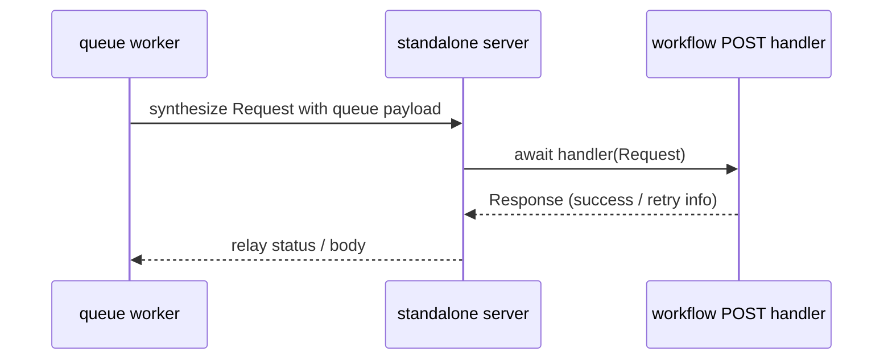

# @workflow/standalone

frameworkless adapters and utilities for running workflow devkit without tying into a specific web framework.

## Purpose

this package sits alongside `@workflow/builders` and `@workflow/cli` to deliver the “minimal workflow runtime” mentioned in the builder refactor follow-up. the builders already emit fetch-compatible handlers for steps, workflows, and webhooks; `@workflow/standalone` provides the thin hosting layer that:

- loads those generated bundles and optional manifests
- exposes helper functions to convert generic http requests into `Request` objects
- offers queue adapters so any message bus can dispatch into the workflow runtime
- powers `workflow build` / `workflow dev` flows when no framework integration is present

## decisions & why

- new package instead of builders: builders stay focused on compilation; i do not want to mix server lifecycles into a bundler. same reason i kept the queue + server glue out here.
- not part of cli either: the cli should depend on this instead of owning the server code. that way folks embedding workflow without the cli can import the helpers directly.
- fetch-first adapters: the generated handlers already speak fetch. using undici (or native fetch) keeps the surface area tiny and lets anything that can form a `Request` play nicely.
- manifest loader lives here: a frameworkless host needs to go from “workflow id” back to function exports. putting that helper next to the server glue keeps it obvious.
- simple http server as the default: shipping a plain `http.createServer` prototype means teams can swap in fastify/elysia/hono by just reusing the adapters, no hidden coupling.






## Planned Contents

- `createStandaloneServer(options)` – spins up a lightweight HTTP server (based on Node’s `http` or your chosen library) that invokes the generated handlers.
- `createRequestAdapter()` – normalises incoming requests from popular servers (Fastify, Elysia, Express) into standard Fetch primitives (using Undici under the hood when necessary).
- `createQueueWorker()` – processes queue messages and forwards them to the workflow/step handlers, respecting the expected Workflow queue topics.
- `loadWorkflowManifest()` – convenience loader for manifests emitted by the builders.

## Usage Sketch

```ts
import { createStandaloneServer } from '@workflow/standalone';

await createStandaloneServer({
  buildDir: '.well-known/workflow/v1',
  port: 3000,
});
```

The helpers will be designed so frameworks can plug in directly as well:

```ts
import Fastify from 'fastify';
import { createRequestAdapter } from '@workflow/standalone';
import workflowHandlers from './.well-known/workflow/v1/flow.js';

const app = Fastify();
const toFetch = createRequestAdapter();

app.all('/.well-known/workflow/v1/flow', async (req, reply) => {
  const response = await workflowHandlers.POST(await toFetch(req));
  reply.status(response.status);
  response.headers.forEach((value, key) => reply.header(key, value));
  reply.send(Buffer.from(await response.arrayBuffer()));
});
```

## Relationship to Other Packages

- `@workflow/builders` continues to own discovery and bundling of workflow code.
- `@workflow/cli` will depend on `@workflow/standalone` to implement `workflow build`/`workflow dev` paths for frameworkless apps.
- Framework-specific packages (Next.js, SvelteKit, Nitro) remain unchanged; they do not pull in this package.

