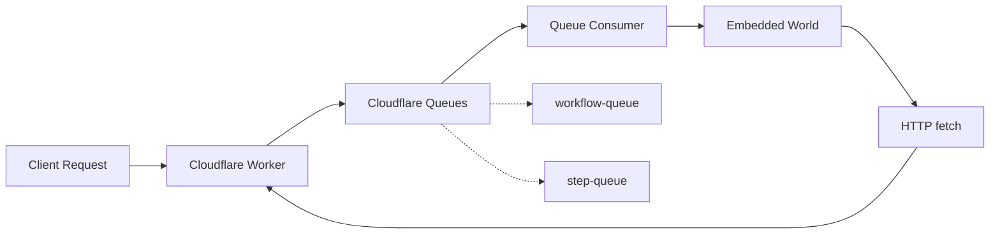
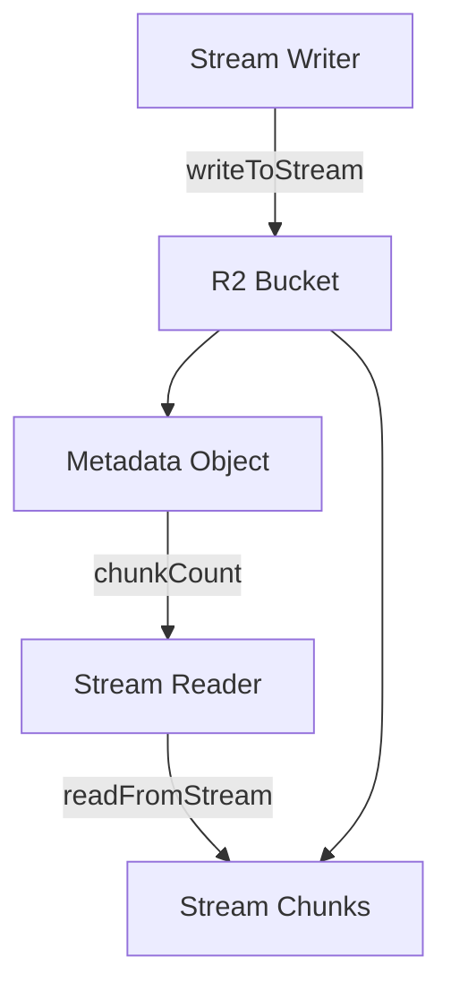

# How Cloudflare World Works

This document explains the architecture and components of the Cloudflare world implementation for workflow management.

This implementation uses [Drizzle Schema](./src/drizzle/schema.ts) that can be migrated into your D1 database and is backed by Cloudflare's D1 (SQLite).

If you want to use a different ORM or query builder, you can fork this implementation and replace the Drizzle parts with your own.

## Architecture Overview

The Cloudflare world leverages native Cloudflare primitives:

- **D1 Database** (SQLite): Stores workflow state, events, steps, and hooks
- **Cloudflare Queues**: Handles asynchronous job processing for workflows and steps
- **R2 Bucket**: Stores stream chunks for workflow streaming
- **Workers Runtime**: Executes workflow logic at the edge

## Job Queue System



### Queue Flow

1. **Client Request**: Workflow or step is queued via `world.queue()`
2. **Cloudflare Queue**: Message sent to `WORKFLOW_QUEUE` or `STEP_QUEUE`
3. **Queue Consumer**: Worker's `queue()` handler receives batch of messages
4. **Embedded World**: Messages are forwarded to embedded world for processing
5. **HTTP Fetch**: Embedded world makes HTTP requests back to Worker endpoints
6. **Execution**: Worker executes workflow/step logic

Messages include:
- Automatic retry logic (Cloudflare Queues handle retries)
- Idempotency keys for exactly-once semantics
- Configurable batch sizes (`max_batch_size: 10`)
- Timeout controls (`max_batch_timeout: 5`)

## Storage

All persistent data is stored in D1 (Cloudflare's SQLite database):

- **workflow_runs**: Workflow execution state
- **workflow_events**: Event log for deterministic replay
- **workflow_steps**: Step execution records
- **workflow_hooks**: Webhook registrations

D1 provides:
- ACID transactions
- SQLite compatibility
- Edge-replicated reads
- Regional writes with global replication

## Streaming

Workflow streaming uses **R2 object storage**:

### Stream Architecture



### How It Works

1. **Write**: Stream chunks stored as R2 objects at `streams/{name}/{index}`
2. **Metadata**: Chunk count tracked in `metadata/{name}` object
3. **Read**: Reader fetches all chunks from start index to current chunk count
4. **Close**: Metadata marked as closed (`{chunkCount, closed: true}`)

Unlike PostgreSQL's LISTEN/NOTIFY, Cloudflare streaming uses R2's object storage with metadata for tracking stream state. This approach is designed for Cloudflare's edge architecture where long-lived connections are not available.

## Queue Consumer Handler

Implement the `queue()` export in your Worker to process queue messages:

```typescript
import { handleQueueMessage } from "@workflow/world-cloudflare";
import type { CloudflareEnv } from "@workflow/world-cloudflare";

export default {
  async queue(batch: MessageBatch, env: CloudflareEnv): Promise<void> {
    for (const message of batch.messages) {
      try {
        await handleQueueMessage(env, message);
        message.ack(); // Success
      } catch (error) {
        message.retry(); // Retry on failure
      }
    }
  }
};
```

The `handleQueueMessage` function:
1. Deserializes the queue message
2. Creates an embedded world instance
3. Forwards the message to the embedded world's queue handler
4. Embedded world makes HTTP requests to execute workflow/step logic

## Edge Runtime Considerations

### Stateless Execution

Cloudflare Workers are stateless and may experience cold starts:
- Each request may run on a different Worker instance
- No shared in-memory state between requests
- All state must be persisted to D1/R2
- Queue consumers handle job processing asynchronously

### Regional Writes

D1 databases have regional write primaries:
- Writes go to the primary region
- Reads can be served from any region (eventually consistent)
- Use transactions for consistency when needed

### Request Limits

Be aware of Cloudflare Workers limits:
- CPU time limits (10ms for free tier, 50ms+ for paid)
- Memory limits (128MB)
- Subrequest limits (50 for free tier, 1000+ for paid)

## Development Workflow

### Local Development

```bash
# Start local dev server with D1
wrangler dev --local

# Apply migrations to local D1
wrangler d1 migrations apply workflow-db --local
```

### Production Deployment

```bash
# Apply migrations to production
wrangler d1 migrations apply workflow-db

# Deploy Worker
wrangler deploy
```

### Queue Testing

Test queue consumers locally:

```bash
# Send test message to queue
wrangler queues producer send workflow-queue '{"test": "message"}'
```

## Comparison with Other Worlds

### vs. world-postgres

| Feature | Cloudflare | PostgreSQL |
|---------|-----------|------------|
| Database | D1 (SQLite) | PostgreSQL |
| Queue | Cloudflare Queues | pg-boss |
| Streaming | R2 polling | LISTEN/NOTIFY |
| Runtime | CF Edge Workers | Node.js |
| Scaling | Automatic | Manual |
| Cold Starts | Yes | No |

### vs. world-local

| Feature | Cloudflare | Local (Embedded) |
|---------|-----------|------------------|
| Persistence | D1 + R2 | Filesystem |
| Distributed | Yes | No |
| Multi-tenant | Yes | No |
| Development | Local + Edge | Local only |
