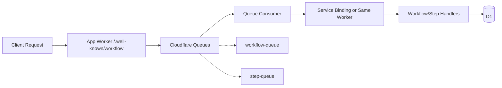
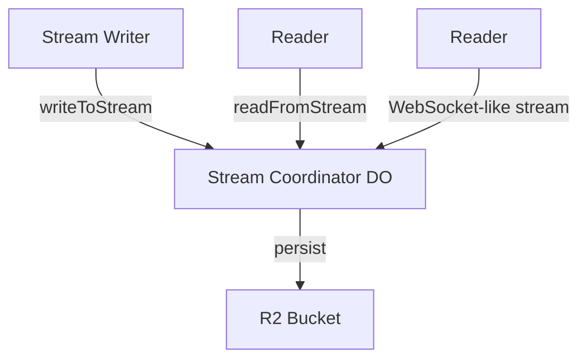

# How Cloudflare World Works

This document explains the architecture and components of the Cloudflare world implementation for workflow management.

This implementation uses [Drizzle Schema](./src/drizzle/schema.ts) that can be migrated into your D1 database and is backed by Cloudflare's D1 (SQLite). The `npx workflow-cloudflare-world` CLI copies the baseline SQL migration into your project so `wrangler d1 migrations apply` works out of the box.

If you want to use a different ORM or query builder, you can fork this implementation and replace the Drizzle parts with your own.

## Architecture Overview

The Cloudflare world leverages native Cloudflare primitives:

- **D1 Database** (SQLite): Stores workflow state, events, steps, and hooks
- **Cloudflare Queues**: Handles asynchronous job processing for workflows and steps
- **R2 Bucket**: Stores stream chunks for workflow streaming
- **Workers Runtime**: Executes workflow logic at the edge

## Job Queue System


```mermaid
graph LR
    Client[Client Request] --> App[App Worker /.well-known/workflow]
    App --> Queue[Cloudflare Queues]
    Queue --> Consumer[Queue Consumer]
    Consumer --> Binding[Service Binding or Same Worker]
    Binding --> Flow[Workflow/Step Handlers]
    Flow --> D1[(D1)]

    Queue -.-> WQ[workflow-queue]
    Queue -.-> SQ[step-queue]
```

### Queue Flow

1. **Client Request**: Your app (or the world Worker) calls `world.queue()` which enqueues a workflow or step message.
2. **Cloudflare Queue**: The payload is written to either `WORKFLOW_QUEUE` or `STEP_QUEUE`.
3. **Queue Consumer**: The Worker's `queue()` handler receives batches from Cloudflare Queues.
4. **Dispatch**: `handleQueueMessage` validates the message and calls your generated `/.well-known/workflow` route through either a service binding (`WORKFLOW_DISPATCH`) or a public origin (`WORKFLOW_DISPATCH_URL`). If the world is bundled with the app, this is just an in-process fetch.
5. **Execution**: The workflow/step handler replays events, talks to D1/R2, executes user code, and may enqueue additional work.

Messages include:
- Automatic retry logic (Cloudflare Queues handle retries)
- Idempotency keys for exactly-once semantics
- Configurable batch sizes (`max_batch_size: 10`)
- Timeout controls (`max_batch_timeout: 5`)

## Storage

All persistent data is stored in D1 (Cloudflare's SQLite database):

- **workflow_runs**: Workflow execution state
- **workflow_events**: Event log for deterministic replay
- **workflow_steps**: Step execution records
- **workflow_hooks**: Webhook registrations

D1 provides:
- ACID transactions
- SQLite compatibility
- Edge-replicated reads
- Regional writes with global replication

## Streaming

Workflow streaming uses **R2 object storage** coordinated by a **Durable Object** to provide push-based delivery:

### Stream Architecture


```mermaid
graph TD
    Writer[Stream Writer] -->|writeToStream| DO[Stream Coordinator DO]
    DO -->|persist| R2[R2 Bucket]
    Reader1[Reader] -->|readFromStream| DO
    Reader2[Reader] -->|WebSocket-like stream| DO
```

### How It Works

1. **Write**: The worker sends chunk data to the `StreamCoordinator` durable object.
2. **Persist**: The durable object writes the chunk to R2 and updates metadata (chunk count, closed flag).
3. **Push**: Connected readers receive the chunk immediately over a live `ReadableStream` (backed by the durable object).
4. **Replay**: When a reader connects, the durable object replays historical chunks from R2 starting at the requested index, then keeps the connection open for new chunks.
5. **Close**: When a stream is closed, the durable object notifies all readers and persists the closed flag.

Durable Objects provide version pinning and stateful coordination so every connection observes consistent behavior even during rolling deployments.

## Queue Consumer Handler

Implement the `queue()` export in your Worker to process queue messages:

```typescript
import { handleQueueMessage, type MessageBatch, type CloudflareEnv } from "workflow-cloudflare-world";

export default {
  async queue(batch: MessageBatch, env: CloudflareEnv): Promise<void> {
    for (const message of batch.messages) {
      try {
        const result = await handleQueueMessage(env, message);
        if (result?.retryAfterSeconds) {
          message.retry({ delaySeconds: result.retryAfterSeconds });
        } else {
          message.ack(); // Success
        }
      } catch (error) {
        message.retry(); // Retry on failure
      }
    }
  }
};
```

The `handleQueueMessage` function:
1. Validates and deserializes the queue message payload.
2. Sends the payload to the workflow or step handler via the configured service binding (preferred) or HTTPS origin so the same generated routes that served the initial request can continue execution.
3. Returns `{ retryAfterSeconds }` when a handler responds with a `timeoutSeconds` hint so the consumer can request a delayed retry from Cloudflare Queues.

This means queue retries, idempotency, and the `createQueueHandler` contract exactly match other worlds even though the infrastructure backing them is Cloudflare-native.

## Edge Runtime Considerations

### Stateless Execution

Cloudflare Workers are stateless and may experience cold starts:
- Each request may run on a different Worker instance
- No shared in-memory state between requests
- All state must be persisted to D1/R2
- Queue consumers handle job processing asynchronously

### Regional Writes

D1 databases have regional write primaries:
- Writes go to the primary region
- Reads can be served from any region (eventually consistent)
- Use transactions for consistency when needed

### Request Limits

Be aware of Cloudflare Workers limits:
- CPU time limits (10ms for free tier, 50ms+ for paid)
- Memory limits (128MB)
- Subrequest limits (50 for free tier, 1000+ for paid)

## Development Workflow

### Local Development

```bash
# Start local dev server with D1
pnpm wrangler dev 

# Apply migrations to D1
pnpm wrangler d1 migrations apply workflow-db 
```

The CLI drops the initial migration file for you (default `migrations/0000_workflow_cloudflare.sql`). Add future SQL files to the same directory before re-running the apply command.

### Production Deployment

```bash
# Apply migrations to production
pnpm wrangler d1 migrations apply workflow-db

# Deploy Worker
pnpm wrangler deploy
```

### Queue Testing

Test queue consumers locally:

```bash
# Send test message to queue
pnpm wrangler queues producer send workflow-queue '{"test": "message"}'
```

## Deployment Patterns

You can deploy this world in two common ways:

1. **Co-located** – Bundle the world with your framework app. The generated `/.well-known/workflow` routes, queue handler, and `createWorld(env)` call all live inside one Worker deployment.
2. **Dedicated Worker** – Deploy the world as its own Worker (plus Durable Object) and reference it from application Workers using a service binding (`WORKFLOW_DISPATCH`). This lets multiple applications share a single world, but you still manage the queues, D1, and R2 instances yourself.

In both cases you control versioning via normal Worker deployments, and the Durable Object keeps streaming state consistent across versions.

> Need a starting point? Run `npx workflow-cloudflare-world` inside your project and it will scaffold `wrangler.json` plus a queue handler (exporting `StreamCoordinator`) tailored to your answers.

## Comparison with Other Worlds

### vs. world-postgres

| Feature | Cloudflare | PostgreSQL |
|---------|-----------|------------|
| Database | D1 (SQLite) | PostgreSQL |
| Queue | Cloudflare Queues | pg-boss |
| Streaming | R2 + Durable Object push | LISTEN/NOTIFY |
| Runtime | CF Edge Workers | Node.js |
| Scaling | Automatic | Manual |
| Cold Starts | Yes | No |

### vs. world-local

| Feature | Cloudflare | Local (Embedded) |
|---------|-----------|------------------|
| Persistence | D1 + R2 | Filesystem |
| Distributed | Yes | No |
| Multi-tenant | Yes | No |
| Deployment | Worker + DO | Node process |
