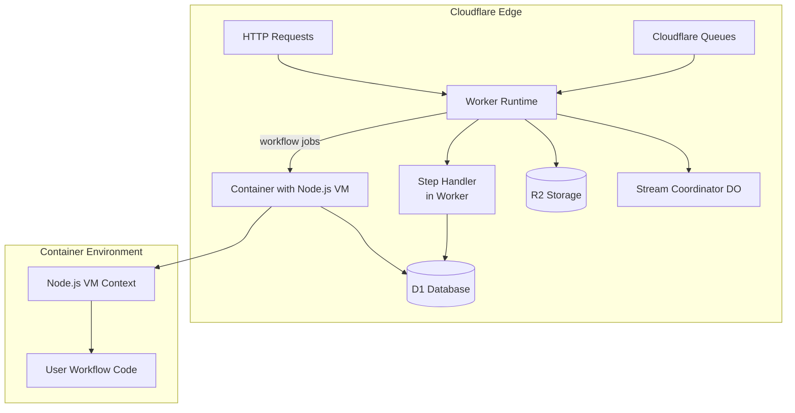
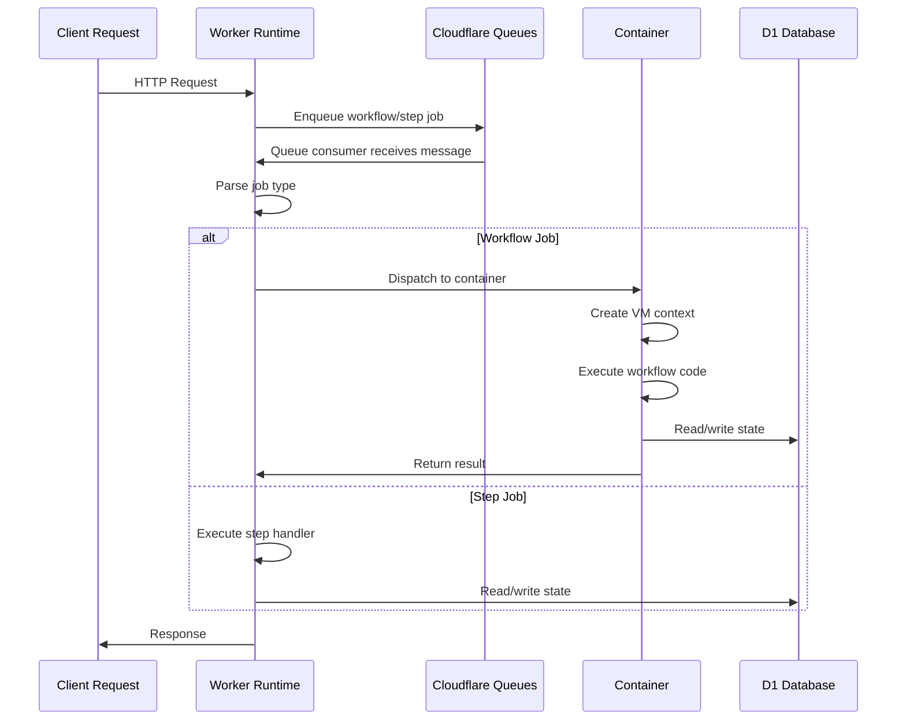
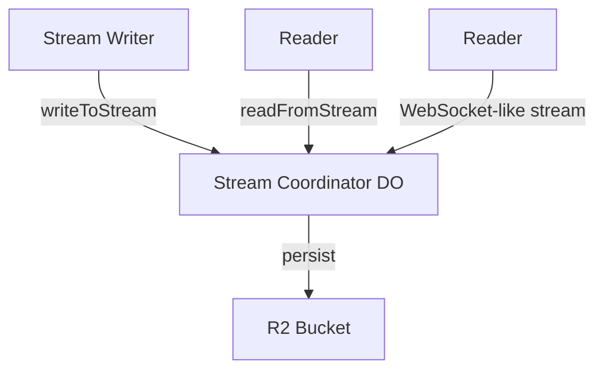
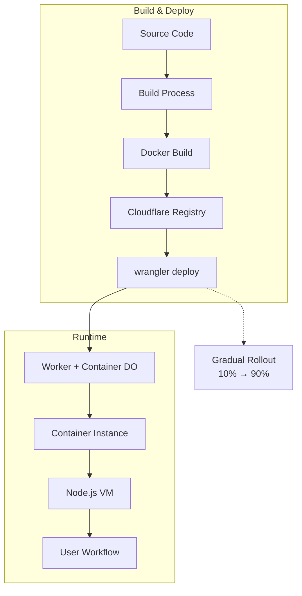

# How Cloudflare World Works

This document explains the architecture and implementation details of the Cloudflare world for workflow management.

## Executive Summary

The Cloudflare workflow world uses a **hybrid architecture** that combines:
- **Cloudflare Workers** for HTTP handling, queue processing, and orchestration
- **Cloudflare Containers** for full Node.js workflow execution with `vm.runInContext()`

This hybrid approach provides the edge distribution benefits of Workers with the complete Node.js runtime required for deterministic workflow execution.

## Why Containers Are Required

Cloudflare Workers have a limited V8 isolates environment that does **not** support:
- `vm.runInContext()` - essential for deterministic workflow execution
- Full Node.js runtime APIs
- Complex module systems

Cloudflare Containers provide:
- Full Node.js runtime environment
- `vm.runInContext()` support for sandboxed workflow execution
- Complete access to Node.js built-ins and modules
- Deterministic execution with seeded randomness and fixed timestamps

## Architecture Overview


```mermaid
graph TB
    subgraph "Cloudflare Edge"
        HTTP[HTTP Requests] --> Worker[Worker Runtime]
        Queue[Cloudflare Queues] --> Worker
        Worker --> StepHandler[Step Handler<br/>in Worker]
        Worker -->|workflow jobs| Container[Container with Node.js VM]
        Container --> D1[(D1 Database)]
        StepHandler --> D1
        Worker --> R2[(R2 Storage)]
        Worker --> DO[Stream Coordinator DO]
    end

    subgraph "Container Environment"
        Container --> VM[Node.js VM Context]
        VM --> Workflow[User Workflow Code]
    end
```

## Component Breakdown

### Workers Runtime
- **HTTP Handling**: Processes incoming workflow API requests
- **Queue Processing**: Consumes messages from Cloudflare Queues
- **Orchestration**: Routes workflow jobs to containers, handles step jobs directly
- **Service Binding**: Provides internal communication between services

### Cloudflare Containers
- **Workflow Execution**: Runs user workflow code in Node.js VM contexts
- **Deterministic Context**: Provides controlled environment for reproducible execution
- **Stateless**: Each workflow run gets an isolated container instance
- **Managed Scaling**: Containers scale based on workflow execution demand

### Storage Layer
- **D1 Database**: SQLite database storing workflow state, events, steps, and hooks
- **R2 Storage**: Object storage for workflow stream chunks
- **Durable Objects**: Stateful objects for stream coordination and container management

## Job Processing Flow


```mermaid
sequenceDiagram
    participant Client as Client Request
    participant Worker as Worker Runtime
    participant Queue as Cloudflare Queues
    participant Container as Container
    participant D1 as D1 Database

    Client->>Worker: HTTP Request
    Worker->>Queue: Enqueue workflow/step job
    Queue->>Worker: Queue consumer receives message
    Worker->>Worker: Parse job type

    alt Workflow Job
        Worker->>Container: Dispatch to container
        Container->>Container: Create VM context
        Container->>Container: Execute workflow code
        Container->>D1: Read/write state
        Container->>Worker: Return result
    else Step Job
        Worker->>Worker: Execute step handler
        Worker->>D1: Read/write state
    end

    Worker->>Client: Response
```

## Queue System

### Queue Types
- **Workflow Queue**: Handles workflow execution jobs
- **Step Queue**: Handles individual step execution jobs

### Message Processing
1. **Enqueue**: `world.queue()` adds jobs to appropriate queue
2. **Consume**: Worker's `queue()` handler processes batch messages
3. **Route**: Jobs routed to containers (workflows) or workers (steps)
4. **Execute**: Jobs processed with retry logic and error handling

### Message Format
```typescript
{
  queueName: string,        // "__wkf_workflow_*" or "__wkf_step_*"
  queueId: string,          // Queue instance identifier
  message: any,             // Workflow/step payload
  messageId: string,        // Unique message identifier
  attempt: number,          // Current attempt count
  idempotencyKey?: string   // Optional deduplication key
}
```

## Container Execution Environment

### VM Context Creation
Each container creates a deterministic Node.js VM context:

```javascript
// Deterministic Math.random()
Math.random = seededRandomGenerator(seed);

// Fixed timestamps
Date.now = () => fixedTimestamp;
new Date() => new Date(fixedTimestamp);

// Deterministic crypto
crypto.getRandomValues = deterministicRandom;
crypto.randomUUID = deterministicUUID;
```

### Execution Process
1. **Container Request**: Worker sends workflow code and execution context
2. **VM Creation**: Container creates deterministic VM context
3. **Code Execution**: Workflow code runs in sandboxed environment
4. **State Management**: Results persisted to D1 database
5. **Response**: Execution result returned to Worker

### Container Lifecycle
- **Cold Start**: 2-3 seconds for initial container initialization
- **Warm Execution**: ~0ms for subsequent requests
- **Sleep**: Container sleeps after 10 minutes of inactivity
- **Scaling**: Manual scaling based on max_instances configuration

## Storage Architecture

### D1 Database Schema
- **workflow_runs**: Workflow execution state and metadata
- **workflow_events**: Event log for deterministic replay
- **workflow_steps**: Step execution records and results
- **workflow_hooks**: Webhook registrations and triggers

### Stream Storage
- **R2 Bucket**: Stores stream chunks as objects
- **Durable Object**: Coordinates stream readers and writers
- **Real-time Delivery**: Push-based stream delivery to connected clients


```mermaid
graph TD
    Writer[Stream Writer] -->|writeToStream| DO[Stream Coordinator DO]
    DO -->|persist| R2[R2 Bucket]
    Reader1[Reader] -->|readFromStream| DO
    Reader2[Reader] -->|WebSocket-like stream| DO
```

## Deployment Architecture

### Single Worker Deployment
The standard deployment pattern uses one Worker that handles:
- HTTP API endpoints (`/.well-known/workflow/*`)
- Queue consumption for both workflow and step jobs
- Stream coordination via Durable Objects
- Container orchestration

### Service Binding Communication
Application Workers connect to the workflow world via service bindings:
```typescript
// In application Worker
"services": [
  { "binding": "WORKFLOW_DISPATCH", "service": "workflow-world-worker" }
]
```

### Container Deployment Strategy

```mermaid
graph TB
    subgraph "Build & Deploy"
        Code[Source Code] --> Build[Build Process]
        Build --> Docker[Docker Build]
        Docker --> Registry[Cloudflare Registry]
        Registry --> Deploy[wrangler deploy]
    end

    subgraph "Runtime"
        Deploy --> Worker[Worker + Container DO]
        Worker --> Container[Container Instance]
        Container --> VM[Node.js VM]
        VM --> Workflow[User Workflow]
    end

    Deploy -.-> Rollout[Gradual Rollout<br/>10% → 90%]
```

## Development vs Production

### Local Development
- **wrangler dev**: Local development with hot reloading
- **Local Docker**: Container execution in local Docker environment
- **Local D1**: Local SQLite database for development

### Production Deployment
- **Global Distribution**: Workers deployed to Cloudflare's edge network
- **Cloudflare Containers**: Container execution in Cloudflare's infrastructure
- **Managed Services**: D1, R2, and Queues as managed Cloudflare services
- **Gradual Rollouts**: Container updates with gradual deployment strategy

## Performance Characteristics

### Latency
- **HTTP Requests**: Edge-optimized latency (milliseconds)
- **Workflow Jobs**: Cold start 2-3s, warm execution ~0ms
- **Step Jobs**: Immediate execution in Workers
- **Queue Processing**: Batch processing with configurable timeouts

### Scaling
- **Workers**: Auto-scale based on request volume
- **Containers**: Manual scaling via max_instances configuration
- **D1**: Automatic read replication, regional writes
- **Queues**: Automatic message distribution and retry

### Limits and Considerations
- **Container Limits**: Account-wide memory, CPU, and disk quotas
- **D1 Limits**: Regional write primaries, eventual consistency
- **Queue Limits**: Message size, retention, and throughput limits
- **Worker Limits**: CPU time, memory, and subrequest quotas

## Monitoring and Debugging

### Container Health
```bash
# Check container status
wrangler containers list

# View container logs
wrangler tail

# Monitor queue processing
wrangler queues list
```

### Common Issues
- **Container Cold Starts**: First execution may have 2-3 second delay
- **Regional D1 Writes**: Write latency varies by region
- **Queue Retries**: Failed messages automatically retry with backoff
- **Stream Connections**: Durable Objects manage connection lifecycle

## Best Practices

### Performance
- Use appropriate container instance types for workflow complexity
- Configure warming periods based on usage patterns
- Monitor container instance utilization
- Optimize D1 query patterns for regional writes

### Reliability
- Implement proper error handling in workflow code
- Use idempotency keys for critical operations
- Monitor queue depths and processing rates
- Set appropriate retry policies for different failure types

### Security
- Use service bindings for internal communication
- Validate all input data in workflow handlers
- Implement proper authentication for external API calls
- Regularly update dependencies and container base images