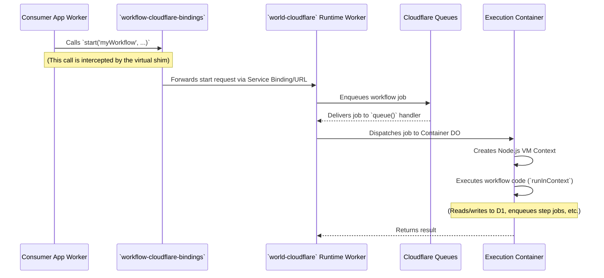
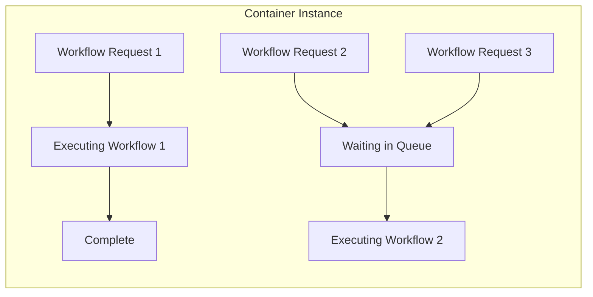
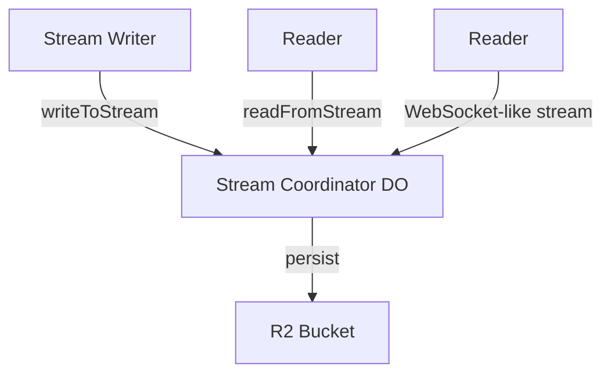

# How Cloudflare World Works

This document explains the architecture and implementation details of the Cloudflare world for workflow management.

## Summary

The Cloudflare workflow world uses a **two-package architecture** to separate the user-facing application from the workflow runtime:

1.  **`workflow-cloudflare-bindings` (Consumer Package)**: A lightweight, Worker-safe package that you install in your application (e.g., a SvelteKit or Next.js app). It provides a Vite plugin and client-side shims that intercept workflow triggers and forward them to the runtime.

2.  **`workflow-cloudflare-world` (Runtime Package)**: A self-contained, deployable application that you deploy to your Cloudflare account. It contains the Node.js execution environment (in a Container), queue handlers, and Durable Objects needed to run workflows.

This split ensures that your application bundle remains small and free of Node.js-specific dependencies, while the heavy lifting of workflow execution is handled by a dedicated, scalable runtime.

## Why a Separate Runtime is Required

Cloudflare Workers have a limited V8 isolates environment that does **not** support:
- `vm.runInContext()`: Essential for the deterministic replay and sandboxing of workflow code.
- `eval()`: Used by the core serializer for certain complex data types.
- Certain Node.js APIs relied upon by the workflow core.

To solve this, the `workflow-cloudflare-world` package runs the workflow engine inside a **Cloudflare Container**, which provides a full Node.js runtime environment. Your application communicates with this runtime instead of trying to execute workflows directly.

## Architecture Overview

```mermaid
graph TD
    subgraph "Your Application (e.g., SvelteKit on Cloudflare)"
        A1[Browser/Client] --> A2[App Worker]
        A2 -- "import { start } from 'workflow/runtime'" --> A3["`workflow-cloudflare-bindings` (Vite Plugin + Shim)"]
        A3 -- "Forwards call via HTTP/DO" --> B1
    end

    subgraph "Deployed Runtime (`workflow-cloudflare-world`)"
        B1[Service Binding or Public URL] --> B2[Runtime Worker Entrypoint]
        B2 --> B3[Cloudflare Queues]
        B3 --> B2
        B2 -- "Workflow Job" --> B4[Container with Node.js VM]
        B4 --> B5[D1 Database]
        B2 -- "Step Job" --> B6[Step Handler in Worker]
        B6 --> B5
    end
```

## Component Breakdown

### 1. `workflow-cloudflare-bindings` (Your App's Dependency)
- **Vite Plugin**: The core of the integration. It performs two key actions at build time:
    1.  **Virtual Module Shim**: It intercepts any imports to `workflow/runtime` and replaces them with a "shim" module. This shim exports functions like `start()` that, instead of running workflows locally, forward the call to your deployed runtime.
    2.  **Entrypoint Rewriting**: It finds the auto-generated workflow queue handlers in your build output and rewrites them to also forward execution to the runtime.
- **Container Client**: A small, Worker-safe utility for communicating with the runtime via Durable Object bindings or a direct URL.

### 2. `workflow-cloudflare-world` (The Deployed Runtime)
- **Pre-built Worker Entrypoint**: A `worker.js` file that you point your `wrangler.toml` to. It comes pre-configured to handle queue messages and export the necessary Durable Objects.
- **Queue Handler**: Logic for consuming messages from Cloudflare Queues and dispatching them. Workflow jobs are sent to the container; step jobs are handled directly in the worker.
- **Container (`WorkflowExecutorContainer`)**: A Durable Object that runs a Node.js container. This is where `vm.runInContext()` is safely executed.
- **Durable Object (`StreamCoordinator`)**: Manages state for streaming operations.
- **Storage Integrations**: Contains the logic for interacting with D1 (state), R2 (streams), and Queues.
- **CLI Wizard**: A command-line tool (`npx workflow-cloudflare-world init`) that generates the `wrangler.toml` and other configuration needed to deploy the runtime.

## How a Workflow Runs (Job Processing Flow)


```mermaid
sequenceDiagram
    participant App as Consumer App Worker
    participant Bindings as `workflow-cloudflare-bindings`
    participant Runtime as `world-cloudflare` Runtime Worker
    participant Queue as Cloudflare Queues
    participant Container as Execution Container

    App->>Bindings: Calls `start('myWorkflow', ...)`
    Note over App,Bindings: (This call is intercepted by the virtual shim)
    Bindings->>Runtime: Forwards start request via Service Binding/URL
    Runtime->>Queue: Enqueues workflow job
    Queue-->>Runtime: Delivers job to `queue()` handler
    Runtime->>Container: Dispatches job to Container DO
    Container->>Container: Creates Node.js VM Context
    Container->>Container: Executes workflow code (`runInContext`)
    Note over Container: (Reads/writes to D1, enqueues step jobs, etc.)
    Container-->>Runtime: Returns result
```

## Queue System

### Queue Types
- **Workflow Queue**: Handles workflow execution jobs
- **Step Queue**: Handles individual step execution jobs

### Message Processing
1. **Enqueue**: `world.queue()` adds jobs to appropriate queue
2. **Consume**: Worker's `queue()` handler processes batch messages
3. **Route**: Jobs routed to containers (workflows) or workers (steps)
4. **Execute**: Jobs processed with retry logic and error handling

### Message Format
```typescript
{
  queueName: string,        // "__wkf_workflow_*" or "__wkf_step_*"
  queueId: string,          // Queue instance identifier
  message: any,             // Workflow/step payload
  messageId: string,        // Unique message identifier
  attempt: number,          // Current attempt count
  idempotencyKey?: string   // Optional deduplication key
}
```

## Container Execution Environment

### VM Context Creation
Each container creates a deterministic Node.js VM context:

```javascript
// Deterministic Math.random()
Math.random = seededRandomGenerator(seed);

// Fixed timestamps
Date.now = () => fixedTimestamp;
new Date() => new Date(fixedTimestamp);

// Deterministic crypto
crypto.getRandomValues = deterministicRandom;
crypto.randomUUID = deterministicUUID;
```

### Execution Process
1. **Container Request**: Worker sends workflow code and execution context
2. **VM Creation**: Container creates deterministic VM context
3. **Code Execution**: Workflow code runs in sandboxed environment
4. **State Management**: Results persisted to D1 database
5. **Response**: Execution result returned to Worker

### Container Execution Model

**Critical**: Each container instance executes **one workflow at a time** (sequentially), not multiple workflows concurrently. I am still working on this limitation.


```mermaid
graph LR
    subgraph "Container Instance"
        Request1[Workflow Request 1] --> Exec1[Executing Workflow 1]
        Request2[Workflow Request 2] --> Queue[Waiting in Queue]
        Request3[Workflow Request 3] --> Queue
        Exec1 --> Complete[Complete]
        Queue --> Exec2[Executing Workflow 2]
    end
```

**Key Characteristics:**
- **One-at-a-Time**: Container processes one workflow to completion before starting the next
- **Sequential Queue**: Multiple workflow requests queue within the same container
- **VM Context Isolation**: Each workflow gets its own fresh VM context
- **Scaling Strategy**: More concurrent workflows = more container instances

**Example with 3 containers, max_instances=10:**
```
Container 1: [Workflow A] → Workflow B → Workflow C (sequential)
Container 2: [Workflow D] → Workflow E (sequential)
Container 3: [Workflow F] (executing)
Containers 4-10: (idle/warming)

Concurrent workflows = 3 (one per active container)
```

### Container Lifecycle
- **Cold Start**: 2-3 seconds for initial container initialization
- **Warm Execution**: ~0ms for subsequent requests
- **Sleep**: Container sleeps after 10 minutes of inactivity
- **Scaling**: Manual scaling based on max_instances configuration
- **Concurrency**: max_instances = maximum concurrent workflows

## Storage Architecture

### D1 Database Schema
- **workflow_runs**: Workflow execution state and metadata
- **workflow_events**: Event log for deterministic replay
- **workflow_steps**: Step execution records and results
- **workflow_hooks**: Webhook registrations and triggers

### Stream Storage
- **R2 Bucket**: Stores stream chunks as objects
- **Durable Object**: Coordinates stream readers and writers
- **Real-time Delivery**: Push-based stream delivery to connected clients


```mermaid
graph TD
    Writer[Stream Writer] -->|writeToStream| DO[Stream Coordinator DO]
    DO -->|persist| R2[R2 Bucket]
    Reader1[Reader] -->|readFromStream| DO
    Reader2[Reader] -->|WebSocket-like stream| DO
```

## Deployment

The architecture relies on two separate deployments to your Cloudflare account:

1.  **Your Application**: This is your main project (e.g., a SvelteKit or Next.js site). It is deployed as a Cloudflare Pages project or a Worker. It has the `workflow-cloudflare-bindings` package installed.

2.  **The Workflow Runtime**: This is a separate deployment of the `workflow-cloudflare-world` package. You configure and deploy this using the `wrangler.toml` generated by the CLI wizard.

### Communication Between App and Runtime
Your application's worker communicates with the runtime worker, typically via a **Service Binding**. This is a secure, low-latency way for two workers on the Cloudflare network to interact.

The `workflow-cloudflare-bindings` client will automatically use the service binding if you configure it in your application's `wrangler.toml`.

### Scaling
- **Workers**: Auto-scale based on request volume
- **Containers**: Manual scaling via max_instances configuration
  - `max_instances: 10` = 10 workflows can run simultaneously
  - Each container handles one workflow at a time (sequentially)
- **D1**: Automatic read replication, regional writes
- **Queues**: Automatic message distribution and retry

**Container Scaling Strategy:**
- More concurrent workflow demand → Increase max_instances
- Each additional container = +1 concurrent workflow capacity
- Containers automatically handle queued workflows sequentially

### Limits and Considerations
- **Container Limits**: Account-wide memory, CPU, and disk quotas
- **D1 Limits**: Regional write primaries, eventual consistency
- **Queue Limits**: Message size, retention, and throughput limits
- **Worker Limits**: CPU time, memory, and subrequest quotas

## Monitoring and Debugging

### Container Health
```bash
# Check container status
wrangler containers list

# View container logs
wrangler tail

# Monitor queue processing
wrangler queues list
```

### Common Issues
- **Container Cold Starts**: First execution may have 2-3 second delay
- **Regional D1 Writes**: Write latency varies by region
- **Queue Retries**: Failed messages automatically retry with backoff
- **Stream Connections**: Durable Objects manage connection lifecycle