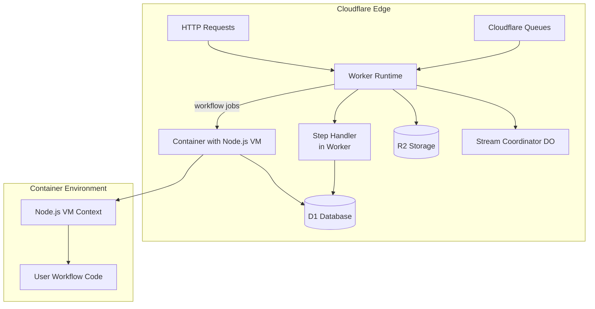

# workflow-cloudflare-world

This package provides a standalone, deployable runtime for executing Workflows on the Cloudflare network. It uses Cloudflare primitives like D1, Queues, R2, and Containers to provide a robust, edge-native environment for your long-running processes.

> **Important: This is the Runtime Engine**
> This package contains the server-side runtime that executes your workflows. It is designed to be deployed as a separate, standalone application in your Cloudflare account.
>
> To integrate Workflows into your front-end or Worker application (e.g., a SvelteKit or Next.js project), you should use the companion package: [`workflow-cloudflare-bindings`](#).

## Quick Start: Deploying Your Runtime

This package includes a CLI wizard to scaffold a new, complete runtime project.

**1. Create a New Runtime Project**

From your terminal, run the `init` command. This will create a new directory with all the necessary configuration files (`wrangler.toml`, `package.json`, `Dockerfile`, etc.).

```bash
# This creates a new project in a directory named `my-workflow-runtime`
npx workflow-cloudflare-world@latest init my-workflow-runtime

# Navigate into your new project
cd my-workflow-runtime
```

**2. Install Dependencies**

Use your preferred package manager to install the dependencies.

```bash
pnpm install
```

**3. Configure and Deploy to Cloudflare**

Follow the instructions printed by the CLI to create your D1 database and deploy the worker.

```bash
# 1. Create the D1 database (only needs to be done once)
wrangler d1 create <your-db-name>

# 2. Apply the initial database schema
wrangler d1 migrations apply <your-db-name>

# 3. Deploy the worker and container
wrangler deploy
```

That's it! Your Cloudflare World runtime is now deployed and running. It will automatically process jobs from the configured Cloudflare Queues.

---

## Connecting Your Application to the Runtime

After deploying your runtime, you need to connect your separate application to it. This is done via a **service binding** in your application's `wrangler.toml`.

**1. Install the Bindings Package**

In your application's project directory (e.g., your SvelteKit or Next.js app), add the `workflow-cloudflare-bindings` package.

```bash
# In your SvelteKit, Next.js, or other Worker-based project
pnpm add workflow-cloudflare-bindings
```

**2. Configure the Vite Plugin (If Applicable)**

If your project uses Vite, add the `cloudflareWorkflowTransformer` to your `vite.config.js`.

```javascript
// vite.config.js
import { defineConfig } from 'vite';
import { sveltekit } from '@sveltejs/kit/vite';
import { cloudflareWorkflowTransformer } from 'workflow-cloudflare-bindings/vite-plugin';

export default defineConfig({
  plugins: [
    cloudflareWorkflowTransformer(), // Add the plugin here
    sveltekit(),
  ],
});
```

**3. Add the Service Binding**

In your application's `wrangler.toml`, add a `[[services]]` binding. This tells your app how to securely communicate with the deployed runtime.

```toml
# In your application's wrangler.toml
[[services]]
binding = "WORKFLOW_RUNTIME"      # This creates `env.WORKFLOW_RUNTIME` for your app
service = "my-workflow-runtime"  # This MUST match the `name` in your runtime's wrangler.toml
```

**4. Initialize the Client in Your Worker**

In your application's server-side entrypoint, call `setupGlobalContainerClient` to make the connection available to your workflows.

```typescript
// Example for a simple Cloudflare Worker
import { setupGlobalContainerClient } from 'workflow-cloudflare-bindings';

export default {
  async fetch(request, env, ctx) {
    // This makes the service binding available to the workflow system
    setupGlobalContainerClient(env);

    // ... your application logic continues here
    // e.g., start a workflow
    // await start('myWorkflow', { input: 'some-data' });

    return new Response("Hello from my app!");
  }
}
```

Your application is now fully connected. When you trigger a workflow, the bindings package will automatically forward the execution request to your standalone runtime.

---

## How It Works: Pre-built Worker Entrypoint

This package provides a pre-built, canonical worker entrypoint that handles all the core runtime logic. The CLI wizard automatically configures your `wrangler.toml` to use it:

```toml
# wrangler.toml generated by the CLI
main = "./node_modules/workflow-cloudflare-world/dist/src/worker.js"
```

This eliminates the need for you to write any custom worker boilerplate. The built-in entrypoint handles:
- **Queue Processing**: Automatically consumes from the workflow and step queues.
- **Durable Object Exports**: Exports `StreamCoordinator` and `WorkflowExecutorContainer` so they can be bound correctly.
- **Health Checks**: Responds to HTTP requests for monitoring purposes.

## Architecture Overview

This implementation uses a **hybrid architecture** that combines Cloudflare Workers for orchestration with Cloudflare Containers for workflow execution.



**Why Containers Are Required**: Cloudflare Workers do not support `vm.runInContext()`, which is essential for the deterministic replay and sandboxing that powers the Workflow system. Cloudflare Containers provide the necessary full Node.js runtime.

## Support

- **Architecture**: See [HOW_IT_WORKS.md](./HOW_IT_WORKS.md) for a detailed architecture guide.
- **Issues**: Report bugs or request features on the GitHub repository.
