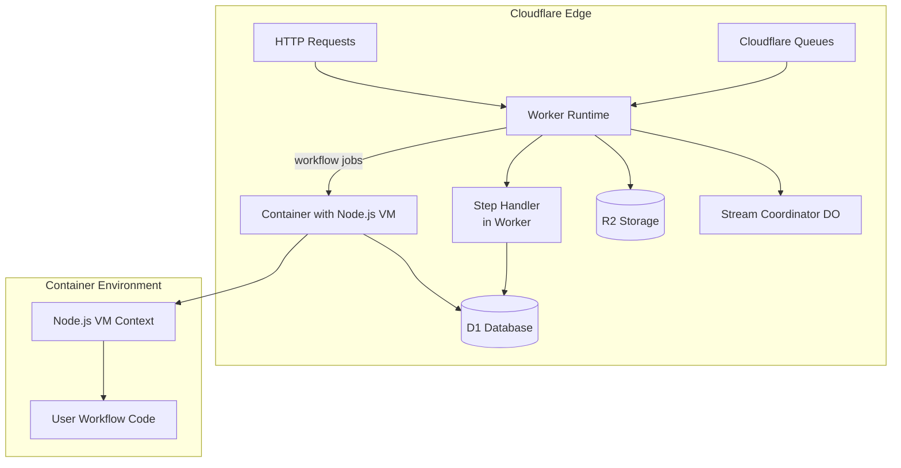

# workflow-cloudflare-world

A workflow system backed by Cloudflare primitives (D1, Queues, R2, Containers) for edge-deployed workflows. This implementation uses Cloudflare Containers to provide full Node.js workflow execution with `vm.runInContext()` support.

RUNTIME-ONLY: This package contains the runtime/container implementation and Node.js-specific code required for deterministic workflow execution (for example, `node:vm` usage and the container entrypoints). It is intended to be deployed as the user-hosted runtime (Cloudflare Containers or any Node-capable host). Do NOT install or import this package directly into Worker application bundles. For Worker-side integration (Vite plugin, Worker-safe container client, and virtual runtime shim) use the separate bindings package `cloudflare-workflow-bindings`. The bindings package provides the Vite transformer and a Worker-safe `defaultContainerClient` so Worker bundles never invoke core VM/`eval`-based serialization locally.

## Quick Start

This package includes a CLI wizard to help you configure and deploy your Cloudflare World.

1.  **Run the Setup Wizard**:
    From an empty directory, run the following command. The wizard will create the necessary configuration files (`wrangler.toml`, `package.json`, etc.).

    ```bash
    npx workflow-cloudflare-world@latest init my-cloudflare-world
    cd my-cloudflare-world
    ```

2.  **Install Dependencies**:

    ```bash
    pnpm install
    ```

3.  **Deploy**:
    Follow the instructions printed by the CLI to create your D1 database and deploy the worker.

    ```bash
    # Create D1 database (first time only)
    wrangler d1 create <your-db-name>

    # Apply database migrations
    wrangler d1 migrations apply <your-db-name>

    # Deploy the worker and container
    wrangler deploy
    ```

That's it. Your Cloudflare World is now deployed. The worker will automatically process jobs from the configured Cloudflare Queues.

## Architecture Overview

This implementation uses a **hybrid architecture** that combines Cloudflare Workers for orchestration with Cloudflare Containers for workflow execution:



**Why Containers Are Required**: Cloudflare Workers do not support `vm.runInContext()` which is essential for deterministic workflow execution. Cloudflare Containers provide the full Node.js runtime needed for proper workflow sandboxing and replay.

## Components

- **D1 Database**: Stores workflow state, events, steps, and hooks
- **Cloudflare Queues**: Handles asynchronous job processing for workflows and steps
- **R2 Bucket**: Stores stream chunks for workflow streaming
- **Workers Runtime**: Handles HTTP requests, queue processing, and orchestration
- **Cloudflare Containers**: Provides Node.js VM execution environment for workflows
- **Durable Objects**: Manages stream coordination and container lifecycle

## Deployment

### Prerequisites

- Docker installed locally for development
- Cloudflare account with Workers, D1, Queues, R2, and Containers enabled

### Configuration

The CLI will generate a `wrangler.json` configuration with container support:

```json
{
  "$schema": "./node_modules/wrangler/config-schema.json",
  "name": "my-workflow-worker",
  "main": "dist/index.js",
  "compatibility_date": "2025-11-10",
  "compatibility_flags": ["nodejs_compat"],

  "containers": [
    {
      "max_instances": 10,
      "class_name": "WorkflowExecutorContainer",
      "image": "./Dockerfile",
      "instance_type": "basic",
      "rollout_active_grace_period": 300,
      "rollout_step_percentage": [10, 100]
    }
  ],

  "durable_objects": {
    "bindings": [
      {
        "name": "STREAM_COORDINATOR",
        "class_name": "StreamCoordinator"
      },
      {
        "name": "WORKFLOW_EXECUTOR",
        "class_name": "WorkflowExecutorContainer"
      }
    ]
  },

  "d1_databases": [
    {
      "binding": "DB",
      "database_name": "workflow-db",
      "migrations_dir": "migrations"
    }
  ],

  "queues": {
    "producers": [
      { "binding": "WORKFLOW_QUEUE", "queue": "workflow-queue" },
      { "binding": "STEP_QUEUE", "queue": "step-queue" }
    ],
    "consumers": [
      {
        "queue": "workflow-queue",
        "script_name": "my-workflow-worker",
        "max_batch_size": 10,
        "max_batch_timeout": 5
      },
      {
        "queue": "step-queue",
        "script_name": "my-workflow-worker",
        "max_batch_size": 10,
        "max_batch_timeout": 5
      }
    ]
  },

  "r2_buckets": [
    {
      "binding": "STREAM_BUCKET",
      "bucket_name": "workflow-streams"
    }
  ],

  "services": [
    {
      "binding": "WORKFLOW_DISPATCH",
      "service": "my-workflow-worker"
    }
  ],

  "vars": {
    "DEPLOYMENT_ID": "my-workflow-worker",
    "WORKFLOW_TARGET_WORLD": "workflow-cloudflare-world"
  }
}
```


## How It Works: Pre-built Worker Entrypoint

This package provides a pre-built, canonical worker entrypoint that wires up the queue handlers, Durable Objects, and a basic health check endpoint.

The CLI wizard automatically configures your `wrangler.toml` to use this entrypoint:

```toml
# wrangler.toml
main = "./node_modules/workflow-cloudflare-world/dist/src/worker.js"
```

This eliminates the need for you to write a custom worker script. The exported worker handles:
- **Queue Processing**: Automatically consumes from `WORKFLOW_QUEUE` and `STEP_QUEUE`.
- **Durable Object Exports**: Exports `StreamCoordinator` and `WorkflowExecutorContainer` so they can be bound in `wrangler.toml`.
- **Health Check**: Responds to `GET /_health` requests with a `200 OK`.

## Container Execution

### VM Context Features

Containers provide a deterministic Node.js VM context with:

- **Deterministic Random**: Seeded `Math.random()` for consistent replay
- **Fixed Timestamps**: Controlled `Date.now()` for reproducible execution
- **Deterministic Crypto**: Controlled `crypto.getRandomValues()` and `crypto.randomUUID()`
- **Full Node.js APIs**: Access to all Node.js built-ins and modules

### Container Execution Model

**Important**: Each container instance executes **one workflow at a time** (sequentially), not multiple workflows concurrently.

- **One Workflow Per Container**: Each container processes one workflow request to completion
- **Sequential Processing**: Multiple workflow requests queue up within a single container
- **Scaling Model**: More concurrent workflows = more container instances
- **Isolation**: Each workflow gets its own VM context within the container

Example with `max_instances: 10`:
```
Container 1: Workflow A → Workflow B → Workflow C (sequential)
Container 2: Workflow D → Workflow E (sequential)
Container 3: Workflow F (executing)
...
Container 10: (idle)

Total concurrent workflows = 3 (one per active container)
```

### Container Lifecycle

- **Cold Start**: 2-3 seconds for first container start
- **Warming Period**: 10 minutes after last request (configurable)
- **Max Instances**: Maximum concurrent containers (default: 10 = 10 concurrent workflows)
- **Instance Types**: From `lite` (1/16 vCPU) to `standard-4` (4 vCPU)

## Development

### Local Development

```bash
# Start local dev server
wrangler dev

# Test queue consumers
wrangler queues producer send workflow-queue '{"test": "message"}'
```

### Production Considerations

- **Regional Writes**: D1 writes go to primary region, reads are global
- **Container Limits**: Account-wide limits on memory, CPU, and disk
- **Queue Retries**: Automatic retry with exponential backoff
- **Streaming**: Real-time stream delivery via Durable Objects

## Integration

The `WORKFLOW_TARGET_WORLD` environment variable tells the Workflow SDK to use this Cloudflare implementation. You still deploy and operate the Worker, containers, queues, D1, R2, and Durable Objects yourself.

## Support

- **Architecture**: See [HOW_IT_WORKS.md](./HOW_IT_WORKS.md) for detailed architecture
- **Container Development**: See [CONTAINER_DEVELOPMENT.md](./CONTAINER_DEVELOPMENT.md) for comprehensive development guide
- **Issues**: Report bugs in the GitHub repository
- **Community**: Join discussions in the Workflow DevKit community
