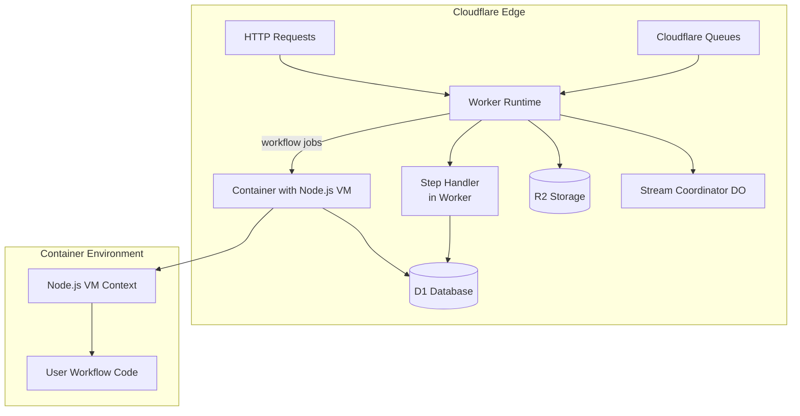

# workflow-cloudflare-world

A workflow system backed by Cloudflare primitives (D1, Queues, R2, Containers) for edge-deployed workflows. This implementation uses Cloudflare Containers to provide full Node.js workflow execution with `vm.runInContext()` support.

## Quick Start

```bash
npm install workflow-cloudflare-world @cloudflare/containers
# or
pnpm add workflow-cloudflare-world @cloudflare/containers
# or
yarn add workflow-cloudflare-world @cloudflare/containers
```

Set the environment variable:

```bash
export WORKFLOW_TARGET_WORLD="workflow-cloudflare-world"
```

Run the CLI to configure your project:

```bash
npx workflow-cloudflare-world
```

## Architecture Overview

This implementation uses a **hybrid architecture** that combines Cloudflare Workers for orchestration with Cloudflare Containers for workflow execution:



**Why Containers Are Required**: Cloudflare Workers do not support `vm.runInContext()` which is essential for deterministic workflow execution. Cloudflare Containers provide the full Node.js runtime needed for proper workflow sandboxing and replay.

## Components

- **D1 Database**: Stores workflow state, events, steps, and hooks
- **Cloudflare Queues**: Handles asynchronous job processing for workflows and steps
- **R2 Bucket**: Stores stream chunks for workflow streaming
- **Workers Runtime**: Handles HTTP requests, queue processing, and orchestration
- **Cloudflare Containers**: Provides Node.js VM execution environment for workflows
- **Durable Objects**: Manages stream coordination and container lifecycle

## Deployment

### Prerequisites

- Docker installed locally for development
- Cloudflare account with Workers, D1, Queues, R2, and Containers enabled

### Configuration

The CLI will generate a `wrangler.json` configuration with container support:

```json
{
  "$schema": "./node_modules/wrangler/config-schema.json",
  "name": "my-workflow-worker",
  "main": "dist/index.js",
  "compatibility_date": "2025-11-10",
  "compatibility_flags": ["nodejs_compat"],

  "containers": [
    {
      "max_instances": 10,
      "class_name": "WorkflowExecutorContainer",
      "image": "./Dockerfile",
      "instance_type": "basic",
      "rollout_active_grace_period": 300,
      "rollout_step_percentage": [10, 100]
    }
  ],

  "durable_objects": {
    "bindings": [
      {
        "name": "STREAM_COORDINATOR",
        "class_name": "StreamCoordinator"
      },
      {
        "name": "WORKFLOW_EXECUTOR",
        "class_name": "WorkflowExecutorContainer"
      }
    ]
  },

  "d1_databases": [
    {
      "binding": "DB",
      "database_name": "workflow-db",
      "migrations_dir": "migrations"
    }
  ],

  "queues": {
    "producers": [
      { "binding": "WORKFLOW_QUEUE", "queue": "workflow-queue" },
      { "binding": "STEP_QUEUE", "queue": "step-queue" }
    ],
    "consumers": [
      {
        "queue": "workflow-queue",
        "script_name": "my-workflow-worker",
        "max_batch_size": 10,
        "max_batch_timeout": 5
      },
      {
        "queue": "step-queue",
        "script_name": "my-workflow-worker",
        "max_batch_size": 10,
        "max_batch_timeout": 5
      }
    ]
  },

  "r2_buckets": [
    {
      "binding": "STREAM_BUCKET",
      "bucket_name": "workflow-streams"
    }
  ],

  "services": [
    {
      "binding": "WORKFLOW_DISPATCH",
      "service": "my-workflow-worker"
    }
  ],

  "vars": {
    "DEPLOYMENT_ID": "my-workflow-worker",
    "WORKFLOW_TARGET_WORLD": "workflow-cloudflare-world"
  }
}
```

### Deployment Steps

```bash
# Create D1 database (first time only)
wrangler d1 create workflow-db

# Apply migrations
wrangler d1 migrations apply workflow-db

# Deploy (containers take 2-3 minutes to provision)
wrangler deploy

# Check container status
wrangler containers list
```

## Worker Setup

Create a worker file that exports the queue handler and StreamCoordinator:

```typescript
import {
  StreamCoordinator,
  WorkflowExecutorContainer,
  handleQueueMessage,
  type CloudflareEnv,
  type MessageBatch,
} from 'workflow-cloudflare-world';

export { StreamCoordinator, WorkflowExecutorContainer };

export async function queue(
  batch: MessageBatch,
  env: CloudflareEnv
): Promise<void> {
  for (const message of batch.messages) {
    try {
      const result = await handleQueueMessage(env, message);
      if (result?.retryAfterSeconds) {
        message.retry({ delaySeconds: result.retryAfterSeconds });
      } else {
        message.ack();
      }
    } catch (error) {
      console.error('Failed to dispatch queue message', error);
      message.retry();
    }
  }
}

export default {
  async fetch(request: Request, env: CloudflareEnv): Promise<Response> {
    const world = createWorld(env);
    // Use world to create/manage workflow runs
    return new Response('OK');
  }
};
```

## Container Execution

### VM Context Features

Containers provide a deterministic Node.js VM context with:

- **Deterministic Random**: Seeded `Math.random()` for consistent replay
- **Fixed Timestamps**: Controlled `Date.now()` for reproducible execution
- **Deterministic Crypto**: Controlled `crypto.getRandomValues()` and `crypto.randomUUID()`
- **Full Node.js APIs**: Access to all Node.js built-ins and modules

### Container Lifecycle

- **Cold Start**: 2-3 seconds for first container start
- **Warming Period**: 10 minutes after last request (configurable)
- **Max Instances**: Configurable concurrent containers (default: 10)
- **Instance Types**: From `lite` (1/16 vCPU) to `standard-4` (4 vCPU)

## Development

### Local Development

```bash
# Start local dev server
wrangler dev

# Test queue consumers
wrangler queues producer send workflow-queue '{"test": "message"}'
```

### Production Considerations

- **Regional Writes**: D1 writes go to primary region, reads are global
- **Container Limits**: Account-wide limits on memory, CPU, and disk
- **Queue Retries**: Automatic retry with exponential backoff
- **Streaming**: Real-time stream delivery via Durable Objects

## Integration

The `WORKFLOW_TARGET_WORLD` environment variable tells the Workflow SDK to use this Cloudflare implementation. You still deploy and operate the Worker, containers, queues, D1, R2, and Durable Objects yourself.

## Support

- **Documentation**: See [HOW_IT_WORKS.md](./HOW_IT_WORKS.md) for detailed architecture
- **Issues**: Report bugs in the GitHub repository
- **Community**: Join discussions in the Workflow DevKit community