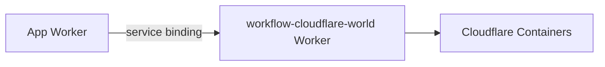
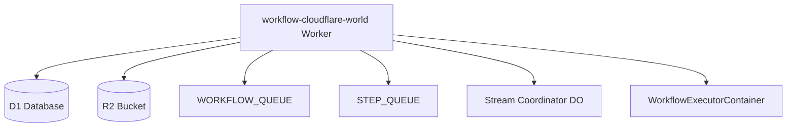
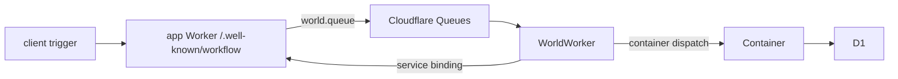
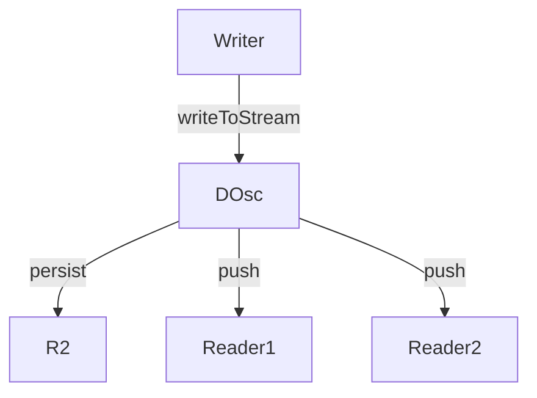

# Cloudflare World Progress Log

This doc tracks every experiment, what I shipped, and where I’m stuck trying to make Workflow DevKit run on Cloudflare Workers + Containers.

## Attempt 1: Coupled Worker + World (no bindings plugin)

I originally tried the “easy” route: install `workflow-cloudflare-world`, set `WORKFLOW_TARGET_WORLD=workflow-cloudflare-world`, and ship everything inside the same SvelteKit Worker. No shims, no plugins.

Result:

1. The Svelte bundle pulled in the entire world implementation, including `@cloudflare/containers`, `cloudflare:*` specifiers, and `node:vm`.
2. Wrangler exploded on build because those imports can’t resolve in SSR.
3. Even if they did, Worker execution hit `vm.runInContext` and `WeakRef` gaps immediately.
4. Queue handlers and Durable Objects had to be exported from the same `_worker.js`, which SvelteKit never emits by default, so I had to patch `.svelte-kit/cloudflare/_worker.js` just to expose `queue` and `StreamCoordinator`.

tl;dr bundling the world directly into the app Worker is a non-starter.

## Attempt 2: Split deployments connected via service binding

I split the stack in two:



Apps now import `workflow-cloudflare-bindings`, point `WORKFLOW_EXECUTOR` at the service binding, and the world Worker handles queues, D1, streams, and container orchestration. Cloudflare Containers run the workflows so the main app just proxies requests.

This architecture solves the VM + serializer issues because actual workflow code never runs inside the Svelte Worker anymore. The world Worker owns that and can rely on Containers + D1.

Problem: the Vite plugin (`packages/workflow-cloudflare-bindings/src/vite-plugin.ts`) is supposed to rewrite the generated `.well-known/workflow/*` handlers so they call the remote executor. With modern SvelteKit output (`const POST = async () => { ... return workflowEntrypoint(...) }`) the transformer never matches, so the Worker bundle still pulls `workflow/runtime`, `workflow/api`, and by extension `@workflow/world-local` which drags in Undici → WeakRef → crash. That’s where everything is stuck.

## How Cloudflare World Works

The world package is a full Worker/Container runtime. It ships a CLI (`npx workflow-cloudflare-world init my-runtime`) that scaffolds:

- `wrangler.toml` with all required bindings (D1, queues, R2, DOs, Containers, service binding).
- `migrations/0000_workflow_cloudflare.sql` so D1 schema is ready.
- Dockerfile + container image wiring for Cloudflare Containers.

Once deployed, you can bind it into any Worker via Wrangler service bindings. I also built a SvelteKit starter (workbench/svelte-cf) that’s publish-ready: `pnpm build && pnpm wrangler deploy` after pointing the binding at the world Worker.

### Architecture Overview



- D1 holds runs, events, steps, hooks (schema lives in `packages/world-cloudflare/src/drizzle/schema.ts`).
- Cloudflare Queues feed workflow jobs (workflow queue) and step jobs (step queue).
- R2 + StreamCoordinator DO give me streaming support.
- Containers provide deterministic workflow execution (Node VM, seedrandom, deterministic Math/Date/crypto).

### Job Queue System



Queue flow:

1. App calls `world.queue()` which writes to `WORKFLOW_QUEUE` or `STEP_QUEUE`.
2. `packages/world-cloudflare/src/worker.ts` exposes `queue(batch)` → `handleQueueMessage`.
3. Workflow jobs get dispatched to the container executor via the binding; step jobs stay inside the Worker.
4. Responses can ask for `timeoutSeconds` to requeue with `message.retry({ delaySeconds })`.

Messages include retry metadata, idempotency keys, and use JSON content-type all the way through.

### Storage

Everything is D1:

- `workflow_runs` tracks lifecycle, inputs, outputs, timestamps.
- `workflow_events` for deterministic replay (ordered ULIDs).
- `workflow_steps` for step attempts and outputs.
- `workflow_hooks` for webhook tokens.

Drizzle ORM is used server-side but it’s just SQLite so you could swap it if needed.

### Streaming



- Writers send chunks to the StreamCoordinator DO (`packages/world-cloudflare/src/stream-coordinator.ts`).
- DO saves each chunk to R2, keeps metadata (chunk count, closed flag), and fan-outs to live readers via `ReadableStream`.
- New readers replay history from R2 based on their `startIndex` and stay subscribed until the stream closes.

### Queue Consumer Handler

```ts
import {
  handleQueueMessage,
  type MessageBatch,
  type CloudflareEnv,
} from 'workflow-cloudflare-world';

export default {
  async queue(batch: MessageBatch, env: CloudflareEnv) {
    for (const message of batch.messages) {
      try {
        const result = await handleQueueMessage(env, message);
        if (result?.retryAfterSeconds) {
          message.retry({ delaySeconds: result.retryAfterSeconds });
        } else {
          message.ack();
        }
      } catch (error) {
        console.error('queue message failed; retrying', message.id, error);
        message.retry();
      }
    }
  },
};
```

`handleQueueMessage` validates the envelope, then dispatches to either `/.well-known/workflow/v1/flow` or `/step` through `WORKFLOW_DISPATCH` (service binding) or `WORKFLOW_DISPATCH_URL`.

### Edge Runtime Constraints

- Workers are stateless, so every bit of workflow state lives in D1 or R2.
- D1 writes are regional; use transactions if you need strict ordering.
- Cloudflare execution limits still apply (CPU, memory, subrequests). Containers mitigate most of the heavy lifting.

### Dev + Deploy UX

```bash
# local dev
pnpm wrangler dev

# apply migrations
pnpm wrangler d1 migrations apply my-db

# deploy runtime
pnpm wrangler deploy
```

The CLI that ships with the world package hides most of this. Run `npx workflow-cloudflare-world init my-runtime`, answer the prompts, and it drops wrangler config, migrations, queue bindings, container config, Dockerfile, etc. The Svelte starter (`workbench/svelte-cf`) is equally turnkey: `pnpm install`, point the service binding at the runtime, deploy.

## Current blocker: Vite plugin transformation

File: `packages/workflow-cloudflare-bindings/src/vite-plugin.ts`

Goal: intercept SvelteKit’s generated workflow endpoint and replace:

```ts
export const POST = workflowEntrypoint(workflowCode);
```

with a handler that:

1. Parses queue headers, loads run/events via `globalThis.__wf__create_world`.
2. Calls the remote executor through `globalThis.__wf__container_client` or `WORKFLOW_EXECUTOR`.

Reality:

- The plugin only looks for `export const POST = workflowEntrypoint(`.
- Modern SvelteKit emits `const POST = async ({ request }) => { ... return workflowEntrypoint(workflowCode)(request); }`.
- Result: no transform, Worker bundle still imports `workflow/runtime`, which brings `workflow/api`, which drags in `@workflow/world-local`, Undici, `WeakRef`, `FinalizationRegistry`. Workers don’t ship those globals, so the route crashes before reaching my proxy.
- Removing `optimizeDeps` overrides doesn’t change anything. The issue is purely that the transformer never runs.
- Temporary mitigation: add `compatibility_flags = ["nodejs_compat", "enable_weak_ref"]` in both the app Worker and the world Worker wrangler configs. That polyfills `WeakRef`/`FinalizationRegistry` so Undici stops crashing, but it still bundles the local world—treat this as a stopgap only.

Until the Vite plugin can detect the new handler shape (or we add a `generateBundle` codemod that rewrites `.svelte-kit/output/server/entries/endpoints/**/*.js` post-build), the app Worker will always bundle the local world and crash on Cloudflare.

## Deployment issues already solved

1. Wrangler main entry must be `.svelte-kit/cloudflare/_worker.js`, not `build/index.js`, otherwise queue/DO exports vanish.
2. `_worker.js` needs patching to merge Svelte fetch with Workflow’s queue + `StreamCoordinator`. `scripts/patch-worker.mjs` handles this.
3. Worker build requires `compatibility_flags = ["nodejs_compat"]` so Node shims exist during SSR.
4. The world package ship with WeakRef + FinalizationRegistry polyfills so Undici can load when the world Worker runs.
5. Container code loads lazily via `container-proxy.ts` so regular builds don’t choke on `cloudflare:*` imports.
6. Queue consumer now uses native Cloudflare queue payloads (no more Vercel transport dependency).

Everything above works today. The only missing piece is getting the bindings plugin to actually rewrite the workflow endpoints so app Workers stop importing the local world. Once that lands, the split architecture (app Worker + world Worker via service binding) should be production-ready.
